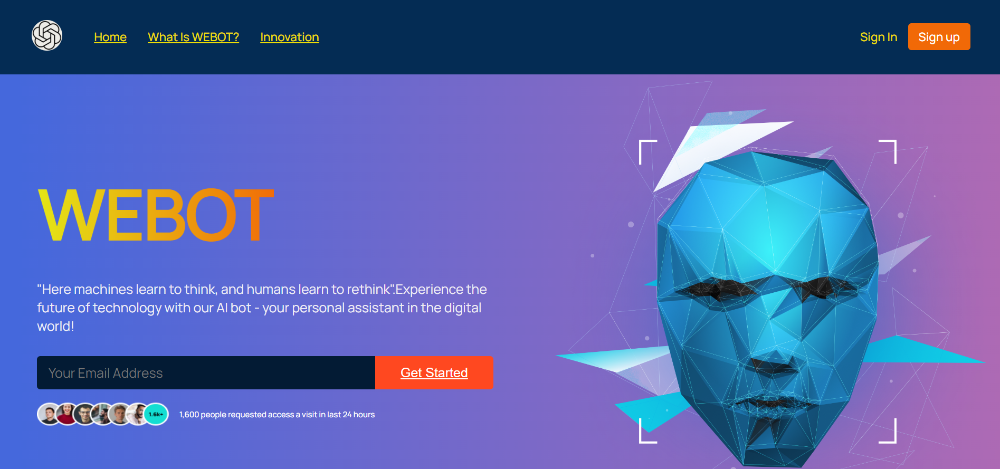
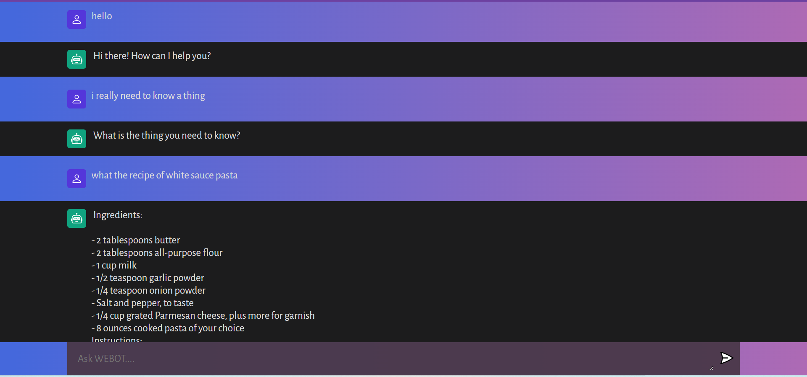

# WEBOT: AI WebApp 
Built with OpenAI and Vanilla.js using Vite.js

## Introduction

This project is a *smart AI chatbot* built with **OpenAI** and **Vanilla.js** using **Vite.js**. It allows users to communicate with an *artificial intelligence* (AI) chatbot and get responses to their queries. The chatbot uses  **OpenAI API** to generate responses based on the user's input.The WebApp is live at this link: https://webot-taniskajha.netlify.app

## Features

The AI chatbot built in this project has the following features:

- *Users can communicate with the chatbot using natural language queries
- *The chatbot uses the OpenAI API to generate responses based on the user's input
- *The chatbot is built using Vanilla.js, a lightweight JavaScript framework, and Vite.js, a build tool that makes it easy to create fast and efficient web applications*.

## Installation

To run this project on your local machine, follow the steps below:

1. Clone the repository from GitHub: `git clone https://github.com/your-username/your-repo.git`
2. Navigate to the project directory: `cd your-repo`
3. Install the dependencies: `npm install`
4. Start the development server: `npm run dev`
5. Open your web browser and go to `http://localhost:X000` to view the chatbot

## Usage

To use the AI chatbot, simply type your query in the input field and hit enter. The chatbot will generate a response based on the OpenAI API.

## Credits

This project was built with the following technologies:

- OpenAI
- Vanilla.js
- Vite.js

